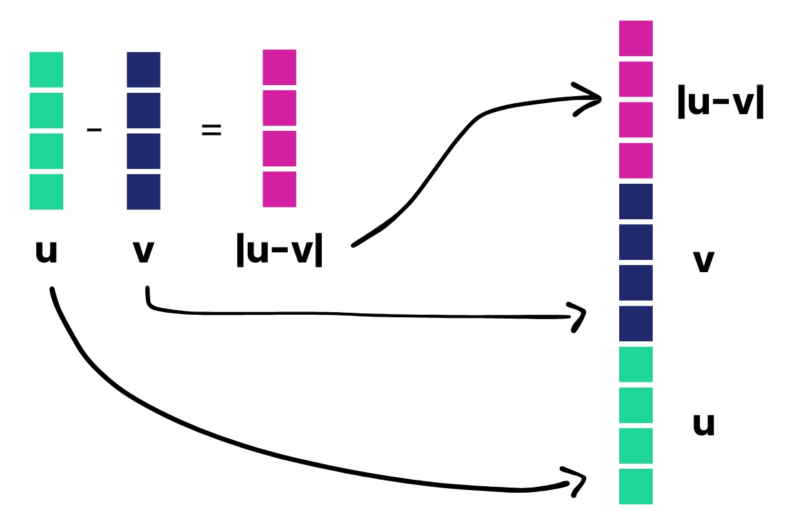

# AI & Data related Job Offers - NLP analysis

## Abstract
This project started with a very simple question: can we understand job offers better if we look deeply into their descriptions?
To find out, we've analyzed thousands of real-world job postings, exploring ways to represent them as vectors using every kind of NLP techniques from the most simple BoW or TF-IDF to embedding models like FastText or even BERT-like pretrained models. By applying LDA, we uncovered hidden topics within the data and visualized how these topics compose the different types of jobs offers such as those more related with the job benefits (health insurance, equality...) or those that focus more in technical aspects (Python, SQL, specific libraries).

Does this stop here? No, of course not. We wanted to create something truly insightful, something that could genuinely impact how we search for jobs. At this stage of our lives, as 3rd and 4th-year students, we start hunting for the best internships available. And from this moment on, job searching becomes a constant part of our lives, always looking for better opportunities. However, there's a major challenge we've repeatedly encountered: most job postings do not specify salaries. According to PayFit, only about 12.6% of job postings worldwide clearly state the offered salary. 

That sparked our idea: why not predict the salary ourselves? Using detailed job descriptions and the associated metadata, we set out to build a regression model capable of estimating the expected maximum salary (`High_salary_estimate (K)`). 

Apart from that, we tried to implement as secondary tasks, some clustering of the job positions, for the real workers to know, what kind of job are there applying to, and some positions that are clearly related to them.

This repo documents our step-by-step journey, from building the initial dataset, to cleaning raw text data, exploring topics and document clusters, to finally building, evaluating predictive models, and experimenting with them in the Dashboard.

## Key Points
- [Task 0: Dataset Construction & Preprocessing](#task-0-dataset-construction--preprocessing)
- [Task 1: Text Preprocessing and Vectorization](#task-1-text-preprocessing-and-vectorization)
- [Task 2: Regression](#task-2-regression)
- [Task 3: Implementation of a dashboard](#task-3-implementation-of-a-dashboard)

## Task 0: Dataset Construction & Preprocessing
We searched for a dataset that satisfied some of the requirements that we wanted for the analysis to be coherent. Specifically, we needed 3 main things:
- A column with the `Job Description`
- A column with the salary related to that position
- Some additional columns for metadata.

As this specific dataset is not usually published by the main job offer platforms such as LinkedIn, Glassdoor, Indeed, and InfoJobs, we initially considered doing some web scraping. However, after evaluating this possibility, we found it technically complex and economically costly due to the robust security measures these websites have in place.

To overcome this, we searched for alternative sources and found multiple specialized datasets publicly available on Kaggle, each containing job postings for different roles within the data and AI field, including Data Scientist, Data Analyst, Data Engineer, and Business Analyst positions. After downloading these individual datasets, we discovered that their structures were slightly inconsistent different columns, some missing values, and even corrupted rows.

We then conducted a thorough preprocessing step, removing unnecessary columns such as 'Unnamed: 0' and 'index', and addressing displaced rows due to formatting issues. After cleaning each dataset individually, we standardized their structure, ensuring each had exactly the same 15 columns. Finally, we concatenated all these cleaned datasets into a single comprehensive dataset containing over 12,000 job offers, which gave us a solid and diverse base for further NLP analysis and salary prediction tasks.

We decided not to include the label that relates each of the positions with the dataset that they come from, that is to say linking a job offer to a class between (data analyst, data scientists, data engineer, and business analyst) because the main scope of the project was not to classify job titles into predefined categories. Instead, we wanted to discover meaningful and latent patterns without imposing any initial assumptions or biases based on the source datasets (that our prior belief is that they were extracted by web scrapping).

This unified dataset was then saved as `dataset_trabajos_ai.csv`, ready for subsequent analysis.

### Dataset Understanding

After constructing our final combined dataset, the next important step was to thoroughly understand its structure and content. Initially, we had 12,782 job postings related to Data & AI jobs. Each posting contained metadata such as the one defined in the table below:

| **Column Name**     | **Description**                                                                                   |
| ------------------- |---------------------------------------------------------------------------------------------------|
| `Job Title`         | The title of the job position as written in the original posting (e.g., *Data Scientist*).        |
| `Salary Estimate`   | Salary range provided in the posting. Often formatted as `$110K-$150K (Glassdoor est.)`.          |
| `Job Description`   | A textual description of the job, including responsibilities, requirements, and company info.     |
| `Rating`            | Numeric rating (0.0–5.0) associated with the company, often taken from platforms like Glassdoor.  |
| `Company Name`      | Name of the company posting the job. Some contain the rating in raw format (cleaned later).       |
| `Location`          | City and state where the job is based in the USA.                                                 |
| `Headquarters`      | Location of the company’s main headquarters.                                                      |
| `Size`              | Size of the company in terms of number of employees (e.g. *1001 to 5000 employees*). Categotrical |
| `Founded`           | Year in which the company was founded. Sometimes missing or unknown (`-1`).                       |
| `Type of ownership` | (e.g., *Private*, *Public*, *Nonprofit*).                                                         |
| `Industry`          | (e.g., *IT Services*, *Healthcare*).                                                              |
| `Sector`            | Broader sector than industry (e.g., *Information Technology*, *Finance*).                         |
| `Revenue`           | Annual revenue of the company (e.g., *\$10+ billion*). Categorical                                |
| `Competitors`       | List of known competitors (if provided). Lots of NAs                                              |
| `Easy Apply`        | Whether the job has a simplified application process. Most values are NAs.                        |


We performed initial data exploration to quickly grasp the nature of our data:

- **Rating** was identified as the only originally numeric column and **it is only related to the company**, making the regression of this variable for job postings making no sense.
- **Salary Estimate** was available as a text range (e.g., `111K - 181K`$), which required additional preprocessing to become usable in numerical analysis.
- Many categorical features contained a significant amount of missing or placeholder values (`-1`, `-1.0`), representing absent information that had to be addressed carefully.
- There are **5823 different Job Titles** and **4921 different Company Names** making the classification by Job Title or Company Name impossible.

We also quickly discovered that there were some features, such as **Easy Apply**, **Founded**, and **Competitors**, contained large percentages of missing values, highlighting the necessity of a solid missing-value strategy. Then we proceed to the next step


### Handling missing values (NAs)

Dealing with missing values was one of the most critical parts of our preprocessing stage. We initially performed a detailed missing values analysis, discovering:

- **Competitors** (72%), **Easy Apply** (95%), and **Founded** (25%) had too many missing values. Given these high percentages, we decided to drop these columns entirely.
- Several other columns had moderate percentages of missing values (around 5%-15%), such as **Revenue**, **Industry**, and **Sector**. Dropping all these rows would result in losing too much valuable data.

Knowing this, we implemented three separate imputation strategies for then to choose which imputation technique was going to be better:

#### Dropping NAs entirely

- Simple but not optimal. We ended up losing approximately 17% of the rows in this approach, slightly above the recommended 5-10%. This approach produced the cleanest dataset quickly, but at the cost of valuable information.

#### Replacing NAs with "Unknown" for categorical features and KNN imputation for Rating

- To retain more data, categorical columns such as **Industry**, **Sector**, **Revenue**, **Headquarters**, and **Size** had their missing values filled with `"Unknown"`.
- For the numeric **Rating** column, we applied **KNN Imputation**, leveraging relevant categorical and numerical information to estimate plausible values. This approach helped maintain dataset size and data quality.

#### Imputation by GroupBy (Mode) and KNN for Rating

- For the most sophisticated approach, we performed imputation using group-specific modes. Missing categorical values were filled based on the most common value in groups defined by similar features like **Company Name**, **Job Title**, and salary ranges.
- Again, **Rating** was imputed using KNN, ensuring consistency and maintaining accuracy in predictions.

After implementing these strategies, we prepared three separate train-test dataset pairs, each with a different handling of missing values:

- **Datasets without NAs**: Approximately 83% of the original size.
- **Datasets with NAs as "Unknown"**: Retained nearly all original data points.
- **Datasets imputed with GroupBy and KNN**: Retained nearly all data, maximizing information preservation.

### Feature Extraction

Given our primary goal—using textual and metadata information to predict job salaries, our next step involved extracting these features as numeric:

* **Salary Estimate** was initially textual and required parsing to become useful numerically. We extracted **Low\_salary\_estimate (K)** and **High\_salary\_estimate (K)** as numeric columns, converting hourly estimates into yearly salaries where necessary.

Apart from these, more feature extraction and selection techniques are applied in future parts of the project, such as converting categorical values to One-Hot Encoding or Ordinal Encoding. But they will be described later on within each of the algorithms chosen

---

## Task 1: Text Preprocessing and vectorization

For the overall tasks we finally chose the second option (**Datasets with NAs as "Unknown" and KNNImputer for Rating**) as the dataset to use for the rest of the analysis. In this part we performed the first great transformation of the raw job descriptions into a cleaner version of these texts making it more suitable for analysis.

### Step 1: Preprocessing with spaCy
By a quick inspection of the first job postings descriptions, it could be appreciated that most of the jobs sections were full of codes terms such as `\n` `<p>`, unnecesary numbers/codes, links to their policies... Then as all this values will just corrupt our further analysis, we made use of Spacy library (because it was the one used in class) with a few external sources, to get rid of all the unnecesary terms.

To have a clearer view, this were the steps implemented on our pipeline:

| Step                         | Description                                                     | Example                                        |
|------------------------------| --------------------------------------------------------------- |------------------------------------------------|
| **Remove HTML tags and URLs** | Remove HTML code embedded in job descriptions.                  | `<p>job description</p>` --> `job description` |
| **Expand contractions**      | Expand English contractions to standard forms.                  | `don't` --> `do not`                           |
| **Tokenization**      | Divide text into individual tokens.                             | `string` --> `list`                            |
| **POS tagging & Filtering**  | Keep only nouns, verbs, adjectives, and proper nouns.           | `"hire"(VERB), "people"(NOUN)`                 |
| **Stopwords Removal**        | Remove common, non-informative words.                           | `"and", "the", "is"` --> removed                 |
| **Lemmatization**     | Reduce words to their base dictionary form.                     | `hired` → `hire`, `companies` --> `company`      |

Although sometimes it is recommended to add our stopwords, we decided not to do so and then further filter by the really repeated words all over our datasets.

Results were stored in an other column called `processed_text`. And here are some example of some random filtered texts:

| Original Job Description                                                                                        | Processed text                                                                                       |
| --------------------------------------------------------------------------------------------------------------- | ---------------------------------------------------------------------------------------------------- |
| "The Business Analyst will coordinate project specific deliverables to ensure successful implementation."       | "business analyst coordinate project specific deliverable ensure successful implementation"          |
| "I am Brad, my wife's name is Sarah, and since 1999 we have been serving Austin as the best little plumbing..." | "brad wife sarah serve austin good little plumbing hvac company texas hire high skilled reliable..." |

### Step 2: Text Vectorization

After this first processing and cleaning of the data, we anted to vectorize the job offers texts so then can be furtherly analized by a Machine Learning Predicting model or used for some clustering techniques.

We decided to put the focus on **three different vectorization techniques** even though some others are also implemented in the regression part of the project:

1. **TF-IDF**: One of the most classic methods that helps us weigh terms based on how unique or informative they are across documents.
2. **FastText**: Pretrained embeddings that include subword information and are really good at dealing with rare or domain-specific vocabulary.
3. **LDA (Latent Dirichlet Allocation)**: To extract topics from the job descriptions and understand latent structures in the dataset.

#### TF-IDF 

BoW and TF-IDF are one of the most common method in Natural Language Processing. Although both were tried, we finally decided to continue our analysis only with the TF-IDF because TF-IDF solves the problem of BoW by penalizing words that appear in many documents.
It assigns each word a weight based on Term Frequency (abreviation TF) and Inverse Document Frequency (abreviation IDF), that implies how often a word appears in a document and how rare it is that word across the documents respectively.

| Parameter | Explanation                                                                                                                                              | Why use it?                                          |
| --------- | -------------------------------------------------------------------------------------------------------------------------------------------------------- | ---------------------------------------------------- |
| `min_df`  | Minimum number of documents a word must appear in to be included. For example, `min_df=3` only words that appear in at least 3 documents.              | Remove very rare words that could be typos or noise  |
| `max_df`  | Maximum proportion of documents a word can appear in to be included. For example, `max_df=0.9` remove words that appear in more than 90% of documents. | Remove very common words that add little information |

By analysing the state of the art, we chose to remove the words that appear more than the 80% of the times, and others that appear less than 3.

After passing each of the documents through this vectorizer, an sparse matrix is built with a value associated with each of the tokens (word) of that document.

For instance, the first job description generated the following TF-IDF scores for its most representative words:

| Word           | TF-IDF Score |
| -------------- | ------------ |
| proprietary    | 0.4988       |
| deliverable    | 0.3717       |
| coordinate     | 0.3315       |
| specific       | 0.3217       |
| successful     | 0.3107       |
| implementation | 0.2606       |

With this vectors, we decided to do a small clustering task (even though it's not the main analysis over this area), by implementing first a dimensionality reduction (using the most simple PCA(n = 2)) and a KMeans with K = 5!

From it, no really big connclusions can be drawn because all the documents seemed to be grouped really close to each other.

But let's see what are the top words in each cluster:

**Cluster: 0**

| Word        | Score     |
|-------------|-----------|
| business    | 0.029662  |
| support     | 0.029092  |
| system      | 0.028049  |
| job         | 0.027519  |

**Cluster: 1**

| Word        | Score     |
|-------------|-----------|
| data        | 0.109561  |
| engineer    | 0.058482  |
| cloud       | 0.053507  |
| pipeline    | 0.045350  |


Some of the clusters really define more defined positions such as Data Engineering with words such as Cloud, Pipeline, Engineer, Spark. Others with positions more related to business/data analytics with words such as learning, team, business, analytic...


#### Fast-Text
While TF-IDF effectively highlights important words, it doesn't fully capture the semantic meaning of text. To address this, we applied FastText embeddings, a Word2Vec-based method that represents words in a kind of semantic vector space. 

We chose as our model `wiki-news-subwords-300d` because it was trained with more than 1 million word vectors trained with subword infomation on Wikipedia 2017, UMBC webbase corpus and statmt.org news dataset.

Previous tries of other Glove pretrained models or Word2Vec approaches weren't based on subword information as FastText do. This allows it to generate vectors for words that **are not in its vocabulary**, which is particularly useful for job descriptions that often include technical terms, rare words, or company-specific terminology.

But how did we get from word embeddings to docs embeddings? To achieve this, I used a simple and effective method called **average pooling**:

$$
\text{Document Vector} = \frac{\text{sum of all word vectors in document}}{\text{total number of words in document}}
$$

This averaging method maintains the overall semantic information of each document without losing critical context.

#### LDA & Topic Selection 

To explore the underlying thematic structure of the dataset, we used **Latent Dirichlet Allocation (LDA)**, a probabilistic model designed to uncover hidden "topics" within large collections of documents. Unlike TF-IDF or FastText, LDA groups documents based on common topics or themes, providing more interpretability. As it is a probabilistic latent model each of the document will just be a linear combination of the topics.

Selecting an optimal number of topics is crucial. To achieve this, we tested several topic numbers (from 4 to 15), evaluating each model by two key metrics:

* **Coherence** (how logically the top words within topics align)
* **Perplexity** (the model's predictive capability on unseen data)

Results from evaluation:


We selected **6 topics** because it achieved the highest coherence while maintaining good predictive performance.

After chosing the best model, we analysed what where the weights of each word in the different topics:


Then, we analysed thanks to the use of the **`pyLDAvis`**, we could analyse how each word contributed to each topic in an interactive way.

(For the following analysis, we recommend the lector to execute well the dashboard or the [Interactive LDA Graph](lda_vis.html))

In the graph can be appreciated the influence of the $\lambda$ parameter. It is used as a multiplier of the probability of a word belonging to a term in the formula:
$$\text{relevance}(w \mid t) = \lambda \cdot p(w \mid t) + (1 - \lambda) \cdot \frac{p(w \mid t)}{p(w)}
$$
In simple terms, the higher, the value of $\lambda$ ($\lambda \approx 1$) shows really frequent words without taking into accounts their exclusivity in that topic, whether $\lambda \approx 0$, shows the most exclusive words in that topic without having into account how frequent they are.

For this trade-off we chose a value different values to study for our analysis in the report. And we obtained several insights. (Note: that the number of the topics do not coincide with the original IDs of the topics in previous parts.)
- Topic 0 ( Topic 6 in pyLDAvis graph) is the smallest topic distribution (it is only represented by a 7.4% of the tokens) but it is really deterministic. Research, health, clinical staph are mostly gathered here, so that helps to identify that this job postings are collecting this part of the Applied Artificial Intelligence to the Medicine)
- Topic 1 (Topic 4 in pyLDavis graph) records job offers where equality in terms of law, status, gender or disability are essential. Most of these postings reflect companies where social benefits and equality play a key role.
- Topic 2 (Topic 1 in pyLDAvis graph) is the largest topic distribution. It centers around business processes, project requirements, and management. This topic is characteristic of job postings that focus on organizational and business analyst roles, often tied to operations or consulting positions.
- Topic 3 (Topic 3 in pyLDAvis graph) appears to be more general-purpose, with recurring terms like system, management, support, and security. These postings are likely associated with roles that emphasize management positions, probably not that related to purely technical staff.
- Topic 4 (Topic 2 in pyLDAvis graph) is highly related to topic 2, but it could be appreciated a bit more of technical details in the terms contained such as machine learning, algorithm, quantitative, science (and a slight displacement in the PC1 axis of LDAvis graph). Probably these job postings relate more to Data Scientist jobs.
- Topic 5 (Topic 5 in pyLDAvis graph) is strongly technical. Terms such as data, engineer, software, cloud, and SQL suggest this topic encompasses core tech jobs, especially in software engineering, data engineering, and cloud computing.

After this analysis, we created a dictionary (based in our opinion of how the topics where)
```
topic_names = {
    0: "Healthcare & Research",
    1: "Equality Consciousness",
    2: "Business Analysts & Project Management",
    3: "Management & High paid roles",
    4: "Data Science & ML",
    5: "Data Engineering & Cloud"
}
```

Knowing that the bet number of topics were 3, we decided  to transform the LDA matrix into a 2D-dimension through an UMAP, and then make a KMeans of 6 groups trying to group the documents in 6 different groups (even though we know that this has nothing to do with LDA approach that divides each document in latent topics)

We decided to use UMAP beacuse it preserves better data structure better than PCA, making it ideal for visualizing complex datasets.
Unlike PCA, which is linear, UMAP captures non-linear relationships, revealing meaningful clusters.
UMAP often produces more compact and interpretable 2D/3D visualizations for tasks like topic modeling or embeddings.


- Each dot is a doc, placed based on how similar its topics are to others (UMAP projection).
Colors show clusters identified by KMeans that was set equal to the best_number of documents for easier visualization.
Then is simple to know that close dots are really similar jobs and different colors are different groups of jobs based on topic similarity.
- The more separated the colors, the clearer the topic difference between clusters. 


With this we conclude the NLP part even though:

> There are more vectorization techniques implemented in the Task 2: Regression. Such as Doc2Vec or SBERT transformer. Details of those will be seen later on and in the report

### References
* [Medium FastText](https://medium.com/aimonks/fasttext-revolutionizing-word-embeddings-and-text-classification-fd0d60f11ffa)
* [UMAP Medium](https://medium.com/mcd-unison/umap-an-alternative-dimensionality-reduction-technique-7a5e77e80982)
* [Latent Dirichlet Allocation – JMLR (Blei et al., 2003)](https://www.jmlr.org/papers/volume3/blei03a/blei03a.pdf)
* [Word2Vec: Efficient Estimation of Word Representations (Mikolov et al., 2013)](https://arxiv.org/abs/1301.3781)
* [FastText: Enriching Word Vectors with Subword Information (Bojanowski et al., 2017)](https://arxiv.org/abs/1607.04606)
* [UMAP: Uniform Manifold Approximation and Projection for Dimension Reduction (McInnes et al., 2018)](https://arxiv.org/abs/1802.03426)
* [An Introduction to t-SNE with Python Examples (Distill.pub)](https://distill.pub/2016/misread-tsne/)
* [Topic Modeling and LDA in Python with Gensim (Real Python)](https://realpython.com/python-nlp-topic-modeling/)

---

# Task 2: Regression

As remarked in the abstract, salary is a key aspect for job seekers, unfortunately most of the job offers do not include the paycheck in their description. Therefore this a great Machine Learning Application where based on some metadata of a job offer plus its text description it is possible to give an idea of the gross anual salary.

## Preprocess

Our data contained Low and High interval of the salary estimate, we believe that the High one  reflects better what companies are willing to pay for top candidates. Furthermore, job seekers tend to focus on the maximum potential salary when evaluating offers. On the other hand, for wide ranges like ($60k-$120k), the low end might represent outliers or entry-level assumptions. Those are some of the reasons why we focused on simulating the best-case scenarios.

Categorical variables are the mayority of features in our metadata, One-Hot encoding was the best and simplest solution for the case but it had a downside. Many categories where too unfrequent, such companies with unique industries and of course unique names. To overcome that, infrequent (freq. = 1) categories where grouped into _'Other'_, this helped to reduce dimensionalty and sparsity in our matrices which led to better models' generalization.

For the only numerical variable present in the dataset, _'Rating'_, standarization was applied to it.

Moreover, although our first model, the MLP, can handle ultra high dimensionalty as ours, XGBoost could not. Our solution was to implement a rather simple but effective _SelectKBest_ as a feature selection, we tried with several _k's_ and at the end _k=20_ worked best.

Lastly, in order to process the job descrption text, we embedded it with previously explained document vectorization techniques as Fasttext and LDA but in this part some additional ones where also carried out, such as Doc2Vec and SBERT.

### Additional Document Embedders

#### Doc2Vec

Is an extension of the Word2Vec algorithm that generates vector representations for entire documents, rather than for individual words. Each document is mapped to a point in a continuous vector space such that semantically similar documents are located close together. Doc2Vec works by training a neural network to predict words in a document using both word context and a unique document identifier. The document vector is learned during this process, capturing semantic content of the entire job description in this case.

Firstly we tokenized and wrapped in a _TaggedDocument_ each job description. This is the format Gensim's Doc2Vec expects, each document (the job desc.) is assigned a unique tag/index that helps the model to learn distinct representations. Regarding the model's parameters we wanted a balance between efficiency and performance so we choosed:

+ For document dimensions, _vector_size=20_
+ A small context window of 2 
+ 50 epochs was more than enough

Then the model was built and trained, and the vector were inferred

#### SBERT 

Sentence-BERT (Sentence Transformers) generates high-qualtity sencence embeddings. One of the main reasons we choose SBERT was because, unlike BERT, it compares and storages efficiently sentence embeddings, this great scalability was crucial since kaggle GPUs where not capable of processing 12k differnet jobs descriptions. 

SBERT is already fine-tuned with a siamese architecture on sentence pairs. As the definiton of siamese indicates, this means we have 2 BERT sentence transformer networks that are exactly the same. This 2 are connected and then a couple of different sentences are passed separately to each BERT so they can embed them. 


As the official hugging face documentation indicates, SBERT uses mean pooling instead of max or [CLS] (so we do). This is because in the orginal SBERT paper, they tested all 3 pooling methods and mean performed best.

Once it has both sentence embeddings, a single vector is obtained by combining them with concatenation. After that, it is fed into a neural network, usually a Feedforward Neural Network (FFNN) whose objective varies depending on the task: Semantic Textual Similarity, Information Retrieval, Clustering, etc.

For coding the actual embedding extract we used the same one indicated at the HF Official Documentation, but to avoid running out ot memory, we coded a batch system that allowed us to embed the text effciently.



**References:**
- [SBERT: How to Use Sentence Embeddings to Solve Real-World Problems [Medium]](https://anirbansen2709.medium.com/sbert-how-to-use-sentence-embeddings-to-solve-real-world-problems-f950aa300c72 "SBERT: How to Use Sentence Embeddings to Solve Real-World Problems [Medium]")
- [Hugging Face Official SBERT (all-MiniLM-L6-v2) Documentation](https://huggingface.co/sentence-transformers/all-MiniLM-L6-v2 "Hugging Face Official SBERT (all-MiniLM-L6-v2) Documentation")
- [Introduction to Sentence Transformers [Marqo]](https://www.marqo.ai/course/introduction-to-sentence-transformers "Introduction to Sentence Transformers [Marqo]")

### Machine Learning Models

#### MLP

Our first idea of a model that could be more resilient to high-dimensional data was a neural network, since we knew overfitting would be a problem we went for a four-layer Multi-Layer Perceptron (MLP) with dropout and batch normalization layers to enhance regularization and training stability. 

To further reduce the risk of overfitting, we employed the _AdamW_ optimizer with weight decay, combined with a Cosine Annealing learning rate scheduler. Additionally, early stopping was implemented with a patience of 50 epochs to stop training once performance stabilized.

The model was trained separately on each type of document vector representation, in every case augmented with the corresponding metadata features.


#### XGBoost

Second approach was traditional machine learning, XGBoost. As mentioned before, it does not handle high-dimensionality as well as the MLP so we introduce _SelectKBest_ as feature selection using _f_regression_ as metric for it.

For the hyperparameter search we used a _RandomSearchCV_ with a validation methodology of _KFold_ (k=3). Again trained 4 times with each vectorization and metadata. All models selected as best _max_depth=3_, very low, which reinforces the overfitting idea, since complex trees resulted on worse results.  

## Results

| Model                  | RMSE       |
|------------------------|----------
| MLP Fasttext     | 41.48  |
| MLP Doc2Vec          | 41.53   |  
| MLP LDA               | 42.96   |
| MLP SBERT  | 42.29  |  
| XGBoost Fasttext    | 37.95   | 
| XGBoost Doc2Vec    | **37.03**  | 
| XGBoost LDA    | 39.12   | 
| XGBoost SBERT    | 37.25   | 


XGBoost performed better in all 4 different vectorizations and specfically vectorization Doc2Vec had the lowest RMSE. Had to mention that XGBoost with SBERT had the lowest MAE with _29.54_, runner up was XGBoost Doc2Vec with _29.84_.


---

# Task 3: Implementation of a dashboard

The Dashboard is an interactive application designed to support the analysis of job postings in the data-related labor market. It combines the designed **Natural Language Processing** and **Machine Learning** models to extract insights and implement them with new data as unstructured *job descriptions*. This implementation allows the users to input textual and categorical information related to job offers, with the aim of providing analytical outputs as **salary predictions**, **topic modeling**, **similarity comparisons** and **language pattern analysis**.

The interface is simple and clean, equipped with several tools and filters. The user can **input a job description** in free text format with optional structured fields such as the *company name*, *location*, *headquarters*, *size*, *industry*, *sector*, *revenue* and *employer rating*. The job description is passed through a **preprocessing pipeline** that performs the text normalization steps (*lowercasing*, *tokenization*, *stopword removal*…) and converts it into embeddings, designed to capture contextual meanings of the words. For further analysis, these embeddings can be **combined** with the numerical and categorical fields to form a complete feature set.

The results that can be obtained in this dashboard as such as:
- **Salary Prediction**: using a **regression model** with a trained **Multilayer Perceptron (MLP)**, based on its characteristics provided by the user and the job description, the app estimates a high-end salary value, which is displayed to the user as an approximate upper salary boundary expressed in thousand of dollars
- **Topic Analysis**: using the **Latent Dirichlet Allocation (LDA)** model, the most relevant topics for the job description are identified. This model produces a distribution of **topic probabilities** which are plotted as a horizontal bar chart. Each topic is shown with the associated **key words** of it, which are the most significative words from a weighted list of words that define the context of the topic, allowing the user to get a better understanding of the job offer he/she is providing.
- **Similarity Search**: using **cosine similarity** over words embeddings, the system finds the most similar job offers to the provided one. The 5 most similar posts are retrieved and displayed in expandable containers that include the *job title*, *company name*, *salary range* and the corresponding detailed *description*. This analysis allows users to find jobs that match with the given description, enabling them to contextualize their target within the broader job market and to observe how it aligns with existing offers.
- **Contrast Analysis**: through a Term Frequency-Inverse Document Frequency (TF-IDF) analysis, most distinctive words are identified among job offers accross different salary ranges, helping to understand which terms are more commonly associated with higher/lower-paying positions. This can provide valuable insights into the skills, qualifications or responsibilities that differentiate jobs based on compensation.


Complementing these results, the dashboard includes a word cloud based on the jobs titles within an selected salary range. Bigger words suggest a higher frequency of the job within that range. The number of displayed terms is limited for clarity. This representation gives a concise overview of role frequency associated with different compensation levels.

Another additional component is the LDA topic structure visualization, which provides an interactive global view of the topic model, showing the clusters, distances between topics and the key terms associated to each topic. It serves for understanding the structure of the underlying topic spaced used for the analysis.

This dashboard application offers valuable insights into the market for job seekers and companies in the data and AI sector. It helps job seekers understand salary trends and find similar opportunities, while companies can analyze job listings, identify key skills and optimize recruitment strategies. By combining salary prediction, topic modeling, and job recommendations, it streamlines decision-making for both parties, making it a practical solution for exploring this evolving job landscape.

---

# Conclusion

This regression task showed the potential of combining traditional machine learning with modern NLP techniques to estimate salaries from job descriptions and metadata, we consider it especially valuable application in contexts where salary information is often private.

We explored both deep learning and gradient boosting models, showing that XGBoost, when paired with appropriate dimensionality reduction (SelectKBest), consistently outperformed the MLP in terms of RMSE across all document vectorization strategies.

Despite the encouraging results, the relatively high RMSE values reflect the noise and limitations of the Glassdoor dataset, where salary labels often represent wide intervals or rough estimates rather than precise values. Moreover, the presence of high-cardinality categorical features and the sparsity of certain classes was definitely challenging that were mitigated but not entirely resolved.

Some future jobs include:
* Fine-tuning SBERT on domain-specific corpora (e.g., tech or finance job descriptions)
* Exploring more advanced ensemble models 
* Incorporating contextual external data (e.g.,market trends)


## Libraries
<table>
  <tr>
    <td></td>
    <td><strong>Pandas</strong><br/>For data manipulation and preprocessing.</td>
  </tr>
  <tr>
    <td></td>
    <td><strong>NumPy</strong><br/>Used for efficient numerical operations and vector handling (FastText embeddings, model matrices, etc.).</td>
  </tr>
  <tr>
    <td></td>
    <td><strong>scikit-learn</strong><br/>Essential for regression models, feature selection, pipelines, cross-validation, and metrics.</td>
  </tr>
  <tr>
    <td></td>
    <td><strong>Matplotlib</strong><br/>Core visualization library used for plotting results, metrics and topic insights.</td>
  </tr>
  <tr>
    <td></td>
    <td><strong>Seaborn</strong><br/>Built on top of Matplotlib, used to create clean and readable visualizations.</td>
  </tr>
  <tr>
    <td></td>
    <td><strong>Gensim</strong><br/>Used for topic modeling (LDA), coherence evaluation, and working with word embeddings like FastText.</td>
  </tr>
  <tr>
    <td></td>
    <td><strong>NLTK</strong><br/>Used during preprocessing for stopword filtering and token handling.</td>
  </tr>
  <tr>
    <td></td>
    <td><strong>spaCy</strong><br/>Lemmatization and additional NLP preprocessing.</td>
  </tr>
  <tr>
    <td></td>
    <td><strong>tqdm</strong><br/>Progress bars for loops.</td>
  </tr>
  <tr>
    <td></td>
    <td><strong>PyTorch</strong><br/>Used to train and deploy deep learning models (MLP for salary prediction, etc.).</td>
  </tr>
  <tr>
    <td></td>
    <td><strong>Transformers (Hugging Face)</strong><br/>Used for leveraging pretrained language models like BERT or DistilBERT for text embeddings.</td>
  </tr>
  <tr>
    <td></td>
    <td><strong>XGBoost</strong><br/>Powerful gradient boosting library used for structured data regression or classification tasks.</td>
  </tr>
</table>


## Authors
Sergio Vizcaino, Iker Rosales, Alejandro Ponce, César Alvarez-Cascos
